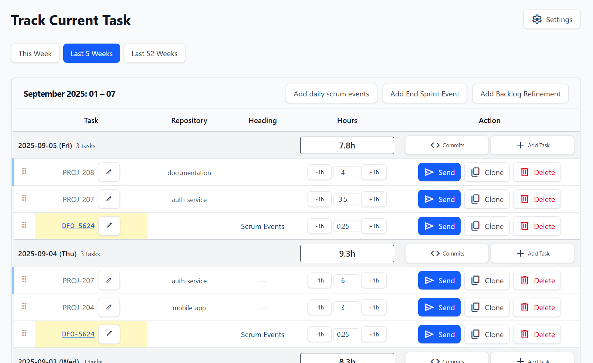

# LogBridge

Automatic time tracking based on Git activity. Built to solve the tedious task of logging development hours to JIRA - this automatically tracks what you're working on and makes time reporting less of a hassle for developers.


*Main dashboard showing weekly time tracking with task breakdown and editing capabilities*

  
*Background tracker running with monthly summary showing 56+ hours tracked across multiple projects*

## Why This Exists

I needed to track which tasks I worked on each day and log them to JIRA. Manually tracking time is disruptive and inaccurate. This system automatically detects when you're working (via Git activity) and logs time accurately, making JIRA time reporting much less painful for me and other developers at my company.

## Components

The system has two independent parts that can work separately:

### 1. Time Logger (Command-line program)
- Runs continuously in the background monitoring configured Git repositories
- Detects changes: file modifications, commits, branch switches
- Logs time in configurable intervals (default: 15 minutes) when activity is detected
- Extracts task IDs from branch names using regex (e.g., `JIRA-123` from `feature/JIRA-123-new-login`)
- Stores data in CSV format in user's AppData folder
- Generates daily and monthly summaries with time breakdown per task

### 2. Web Interface  
- Views time logs from CSV files (auto-loads in dev mode, manual upload in production)
- Edit time entries - adjust hours, dates, task assignments
- Copy entries and move them between days
- GitHub integration - view commits for specific days from authorized repositories
- JIRA integration - authenticate and sync time entries as worklogs
- Weekly/daily time breakdown views
- CSV export/import functionality


*GitHub integration showing commits for a specific day to help with time tracking accuracy*


*Settings panel showing connected JIRA and GitHub integrations for seamless workflow*

## How It Works

```
┌─────────────────┐    CSV Files    ┌─────────────────┐
│  Time Logger    │─────────────────▶│   User Folder   │
│                 │                  │                 │
│ • Watches Git   │                  │ • activity.csv  │
│ • Logs time     │                  │ • config.json   │
│ • Extracts IDs  │                  │                 │
└─────────────────┘                  └─────────────────┘
                                              │ CSV Files
                                              │
                                              ▼
                                     ┌─────────────────┐
                                     │    Frontend     │◀─┐
                                     │                 │  │
                                     │ • View hours    │  │ Commits
                                     │ • Edit entries  │  │
                                     │ • Upload CSV    │  │
                                     │ • Send to JIRA  │  │
                                     └─────────────────┘  │
                                              │           │
                                              │ HTTP/Auth │
                                              ▼           │
                                     ┌─────────────────┐  │
                                     │    Backend      │  │
                                     │                 │  │
                                     │ • JIRA proxy    │  │
                                     │ • GitHub OAuth  │──┘
                                     │ • Auth cookies  │
                                     └─────────────────┘
                                              │
                                              ▼ API calls
                                     ┌─────────────────┐
                                     │      JIRA       │
                                     │                 │
                                     │ • Worklogs      │
                                     │ • Tasks         │
                                     └─────────────────┘
```

## Installation

### Option 1: Use Deployed Version (Easiest)

1. **Get the time logger**: Download latest release from [Releases](https://github.com/kacan98/track-current-task/releases)
2. **Run the logger**: Execute the program - it will guide you through setup
3. **Use web interface**: Visit the deployed site on Vercel (URL to be added)
4. **Upload your CSV**: The logger generates CSV files you can upload to the web interface

### Option 2: Run Everything Locally

```bash
# Clone and install
git clone <repository-url>
cd track-current-task
npm install

# Copy environment configuration
cp .env.example .env
# Edit .env with your settings

# Start the application (runs both frontend and serverless backend)
npm start
# This starts Vercel dev server at: http://localhost:3000
```

## Time Logger Configuration

Running the time logger for the first time will show an interactive setup guide. You can configure:
- Which repositories to monitor
- Time tracking interval (how often to check and how much time to log)
- Task ID extraction pattern (regex for pulling IDs from branch names)
- JIRA URL for linking tasks

Config is stored at: `%APPDATA%/.TrackCurrentTask/` (Windows) or `~/.TrackCurrentTask/` (Mac/Linux)

For automatic startup, place the executable in your system's startup folder.

## Data Storage

### CSV Format
```csv
date,taskId,hours
2023-10-27,JIRA-123,0.5
2023-10-27,feature/new-feature,1.0
```

Location: `%APPDATA%/.TrackCurrentTask/activity_log.csv`

### When Time is Logged
- File changes detected (different line count from last check)
- New commits compared to main branch  
- Branch checkout (first time on branch)

## Project Structure

```
├── packages/
│   ├── background-tracker/   # Time logger (Git monitoring & tracking)
│   ├── backend/       # Express API (serverless-ready)
│   └── frontend/      # React web interface
├── shared/            # Common utilities and types
└── vercel.json       # Deployment configuration
```